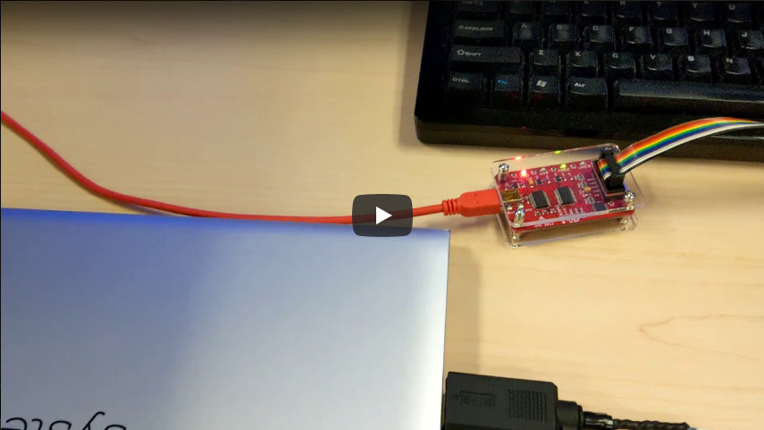
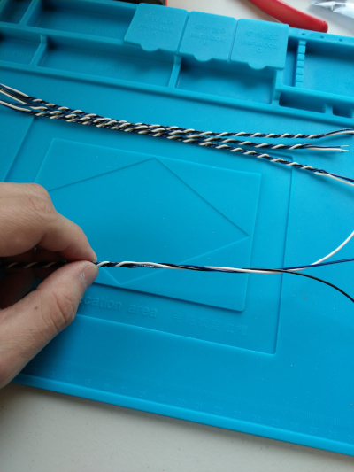
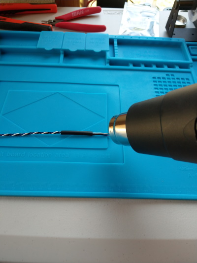

# Nate's Custom Bus Pirate FW for I<sup>2</sup>C Serial Debug

This firmware is a fork of the [Bus Pirate Community Firmware](https://github.com/BusPirate/Bus_Pirate) that adds an I<sup>2</sup>C Serial Debug feature. The I<sup>2</sup>C Serial Debug mode makes the Bus Pirate function as a I<sup>2</sup>C slave device. This slave device emulates a bi-directional UART + null modem, providing a simple means of data transfer between a device that implements an I<sup>2</sup>C master interface and any USB equipped computer.

## Closed Chassis Debug over HDMI

The original motivation for creating this is to enable closed chassis debug on laptop systems using a HDMI port. By using a custom BIOS image and a Bus Pirate, the DDC ([Display Data Channel](https://en.wikipedia.org/wiki/Display_Data_Channel)) pins on the HDMI connector can be used like a serial port.

[](http://www.youtube.com/watch?v=xe7cFhRsr80 "HDMI I2C Debug Demo using a Bus Pirate")

The underlying bus protocol for DDC is I<sup>2</sup>C, this allows the use of slave device addresses that do not conflict with any device addresses used by the DDC standard. This allows the HDMI port to be simultaneously used for both video output and serial data transfer.

### Advantages

Using the HDMI port DDC is an elegant solution for debugging the very early stages of firmware execution on modern Intel chipsets. On modern Intel chipsets, main memory is not available when the CPU comes out of reset. This is because the memory controller is not yet initialized. Because the memory controller is not available, it is not possible to perform a [DMA](https://en.wikipedia.org/wiki/Direct_memory_access), only [PIO](https://en.wikipedia.org/wiki/Programmed_input/output) is available early in the boot process.

The inability to perform DMA extremely limits our options for I/O early in the boot process. Most modern bus controllers require DMA. For example, the XHCI specification requires DMA to transfer data over USB, so USB based methods are not possible. I<sup>2</sup>C is one of the few bus controllers still present in modern chipsets with a PIO access method while also being commonly exposed on modern laptop motherboard designs (indirectly through the HDMI port.)

## Provisioning Your Bus Pirate

### Updating the Bootloader

This firmware image requires Bootloader <b>v4.5</b> or later. Bootloader v4.4 and earlier have a bug which causes [incompatibility](https://github.com/BusPirate/Bus_Pirate/issues/38) with the Bus Pirate Community Firmware v7.x (and as a consequence this firmware as well.) Since Bootloader v4.5 is not officially released by Dangerous Prototypes, none of the Bus Pirate manufactureres load it by default.

Thankfully, [USBEprom](http://dangerousprototypes.com/forum/index.php?topic=8498.75) on the Dangerous Prototypes Forums has built an easy-to-use updater which I have mirrored for convinence. This updater can only be used if your Bus Pirate already has Bootloader v4.x installed. <b>If you have a &lt;v4 bootloader, make sure to update to v4 using the [official Dangerous Prototypes method](http://dangerousprototypes.com/blog/2010/01/18/how-to-bus-pirate-bootloader-v4-upgrade/) before attempting to update to v4.5.</b>

#### Instructions

<b>If you already have Bootloader v4.5, skip to [Install the I<sup>2</sup>C Debug Firmware](#install-the-i<sup>2</sup>c-debug-firmware)</b>

1. <i>(Optional)</i> Run a [Self-Test](http://dangerousprototypes.com/blog/2009/07/28/bus-pirate-self-test-guide/) to make sure your Bus Pirate is functioning before starting.

2. Download [BPv3-bootloader-upgrade-v4xtov4.5.hex](https://raw.githubusercontent.com/nate-desimone/Bus_Pirate/master/BPv3-bootloader-upgrade-v4xtov4.5.hex)
    - If you have not already, download the official [Bus Pirate package v6.1](https://github.com/DangerousPrototypes/Downloads/blob/master/BusPirate.package.v6.1.zip)

3. Flash the upgrader program to your Bus Pirate using pirate-loader
    - `pirate-loader.exe --dev=COM4 --hex=BPv3-bootloader-upgrade-v4xtov4.5.hex`
    - On Linux/macOS, the --dev parameter should contain the /dev/tty* device file for your serial port.
    - Power cycle the Bus Pirate

4. Open a terminal and press &lt;enter&gt; to see the updater greeting. Type 'yes' and press &lt;enter&gt; again to install the update.

```
Universal DS30 Loader installer v0.4 (C)hris 2010

Released under Creative Commons null license.
Found bootloader v4.4
Will install bootloader v4.5

Type 'Yes' to program the new bootloader.
Disconnect power if unsure (no harm done).

Yes

Erasing 0xA400... done
Erasing 0xA800... done
Writing row 0 1 2 3 4 5 6 7 done
Erasing 0x0000... done
Writing row 0... done

Success!
Upload new firmware with the ds30 Loader app to complete the upgrade.
```

5. <b>DO NOT REMOVE POWER</b>, immediately run pirate-loader again and install the official v6.1 firmware.
    - `pirate-loader.exe --dev=COM4 --hex=BPv3-frimware-v6.1.hex`

6. Power cycle the Bus Pirate and open a terminal and check to make sure the bootloader is now v4.5 using the "`i`" command:

```
HiZ>i
Bus Pirate v3.5
Firmware v6.1 r1676  Bootloader v4.5
DEVID:0x0447 REVID:0x3046 (24FJ64GA002 B8)
http://dangerousprototypes.com
HiZ>
```

### Install the I<sup>2</sup>C Debug Firmware

1. Download [BPv3-firmware-v7.1-i2cdebug-v1.0.hex](https://raw.githubusercontent.com/nate-desimone/Bus_Pirate/master/BPv3-firmware-v7.1-i2cdebug-v1.0.hex)

2. Flash the new firmware using pirate-loader
    - `pirate-loader.exe --dev=COM4 --hex=BPv3-firmware-v7.1-i2cdebug-v1.0.hex`
    - On Linux/macOS, the --dev parameter should contain the /dev/tty* device file for your serial port.
    - Power cycle the Bus Pirate

3. Open a terminal and verify the firmware version using the "`i`" command:

```
HiZ>i
Bus Pirate v3.5
Community Firmware v7.1 - goo.gl/gCzQnW (with I2C Debug FW v1.0)
[HiZ 1-WIRE UART I2C SPI 2WIRE 3WIRE PIC DIO] Bootloader v4.5
DEVID:0x0447 REVID:0x3046 (24FJ64GA00 2 B8)
http://dangerousprototypes.com
HiZ>
```

4. <i>(Optional)</i> Run a [Self-Test](http://dangerousprototypes.com/blog/2009/07/28/bus-pirate-self-test-guide/) to make sure your Bus Pirate still works properly.

## Using I<sup>2</sup>C Debug Port Mode

1. Open a terminal, use the "`m`" command to switch the Bus Pirate mode to I<sup>2</sup>C mode. The speed does not matter as the clock signal is not generated by the Bus Pirate in I<sup>2</sup>C Debug Port mode.

```
HiZ>m
1. HiZ
2. 1-WIRE
3. UART
4. I2C
5. SPI
6. 2WIRE
7. 3WIRE
8. PIC
9. DIO
x. exit(without change)

(1)>4
Set speed:
 1. ~5KHz
 2. ~50KHz
 3. ~100KHz
 4. ~400KHz

(1)>
Clutch disengaged!!!
To finish setup, start up the power supplies with command 'W'
Ready
I2C>
```

2. Use the "`(5)`" command to switch to I<sup>2</sup>C Debug Port mode.

```
I2C>(5)
I2C Debug Port
Press F12 to exit
```
## Connecting the Bus Pirate to the HDMI Port

The needed physical connection is:

```
HDMI Port                   Bus Pirate
---------                   ----------
Pin 15 (DDC SCL)    <---->  CLK
Pin 16 (DDC SDA)    <---->  MOSI
Pin 17 (DDC GND)    <---->  GND
```

There are two methods of accomplishing this:

1. Mid-Bus Probe - This allows HDMI video AND serial debug simultaneously over a single port
2. Direct Connection - Enables serial debug without video

### Option 1 - Mid-Bus Probe

With this method I do not recommend anything that involves soldering by hand. The high speed TMDS signals used for HDMI video are extremely sensitive to signal integrity issues; it would be very difficult to hand solder a robust interconnect. I recommend a machine soldered solution.

Pre-built breakout boards are available online. I found this one for example but have not tried it yet (Note: I have no relation to the seller): https://www.ebay.com/c/556721754

### Option 2 - Direct Connection

For the direct connection method, since only low speed I<sup>2</sup>C is involved, hand soldering is fine. I used the [Adafruit HDMI Plug Breakout Board](https://www.adafruit.com/product/3119) (Note: I have no relation to the seller) to create a simple cable:




